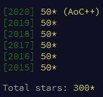

# Advent of Code

Complete solutions to Advent of Code problems in Haskell.

- All years are fully completed. I aimed for idiomatic and relatively clean solutions.
- 2019 was the first year I attemped - it's fully solved, with days 1-18 being less clean, and 19-25 being those that I came back to revisit a year later.

The modules `Coord` and `Grid` contain various tools for working with 2D and 3D grids, and `Utils` contains a grab-bag of generally AOC-friendly tooling.
